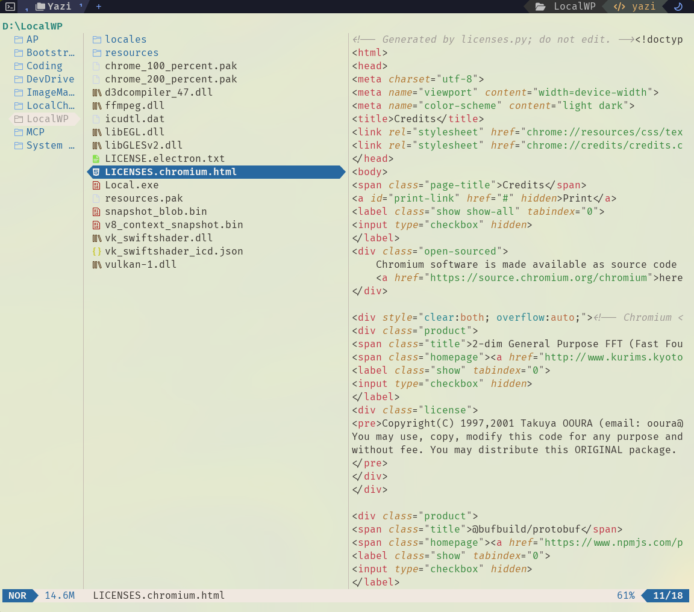

<div align="center">
  
</div>

<h3 align="center">
	Aurora Dawn Arrows Flavor for <a href="https://github.com/sxyazi/yazi">Yazi</a>
</h3>

## 👀 Preview



## ✨ Features

- **Soft & Eye-Friendly:** Uses warm, creamy off-whites (`#faf5ef`, `#f0e8e0`) to reduce harsh glare often found in pure-white light themes.
- **Nature-Inspired Palette:** Carefully chosen accent colors including ocean blues, forest greens, and sunrise roses/ambers.
- **High Readability:** Deep charcoal foregrounds (`#3a3530`) ensure text is always crisp and easy to read.
- **Distinctive UI Elements:** Clear visual hierarchy for active tabs, selected files, and the status bar.
- **Custom Filetype & Icon Colors:** Beautifully color-coded icons and MIME types to help you visually parse your directories at a glance.

## 🎨 Installation

### Manual install

```bash
# Linux/macOS
git clone https://github.com/kshawkat/aurora-dawn-arrows.yazi.git ~/.config/yazi/flavors/aurora-dawn-arrows.yazi

# Windows
git clone https://github.com/kshawkat/aurora-dawn-arrows.yazi.git %AppData%\yazi\config\flavors\aurora-dawn-arrows.yazi
```

## ⚙️ Usage

Add the these lines to your `theme.toml` configuration file to use it:


```toml
[flavor]
use = "aurora-dawn-arrows"
# For Yazi 0.4 and above
# switch between light and dark automatically based on terminal settings
dark = "aurora-storm-arrows"
light = "aurora-dawn-arrows"
```

## ⚙️ Requirements

- [Yazi](https://github.com/sxyazi/yazi) v0.4 or higher.
- A terminal emulator that supports true color (24-bit).
- A Nerd Font installed and configured in your terminal (for the icons).

## 💡 See Also

Prefer a darker look? Check out the storm version: **[Aurora Storm Arrows](https://github.com/kshawkat/aurora-storm-arrows.yazi)**!

## 🤝 Contributing

Pull requests and suggestions are welcome! If you find a UI element that lacks styling or have ideas to improve the color balance, feel free to open an issue.

## 📜 License

The flavor is MIT-licensed, and the included tmTheme is also MIT-licensed.

Check the [LICENSE](LICENSE) and [LICENSE-tmtheme](LICENSE-tmtheme) file for more details.
